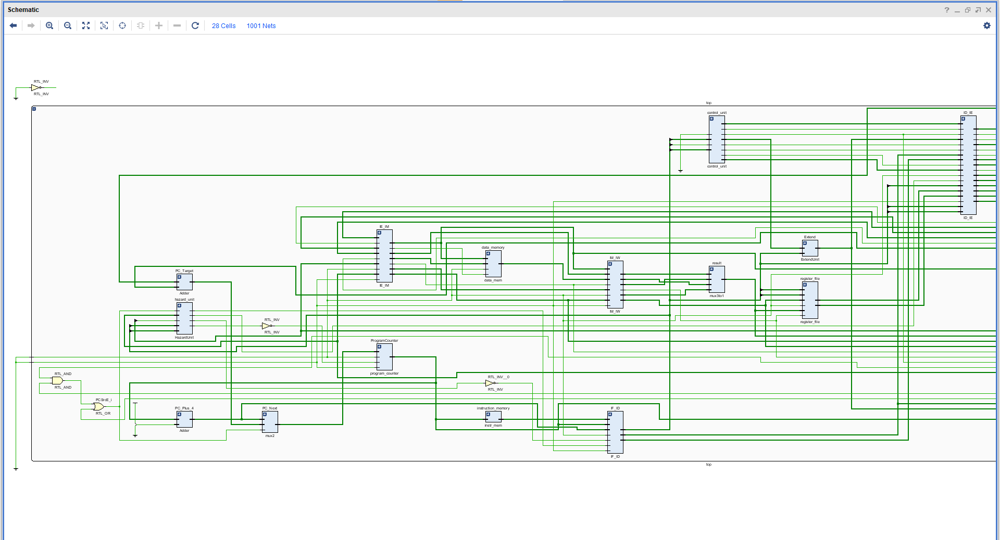
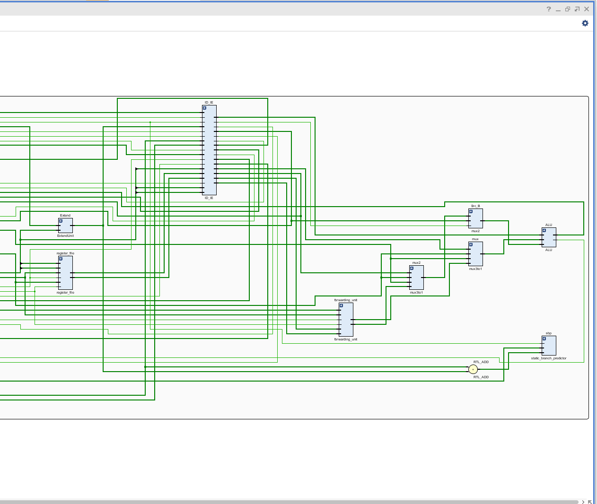

# 🚀 Static Branch Predictor for RISC-V Processor

## 📌 Overview

This project implements a **Static Branch Predictor** integrated with a pipelined **RISC-V processor datapath**.

The predictor reduces **control hazards** by applying predefined static branch prediction rules based on branch direction. Static prediction improves pipeline efficiency by making fixed assumptions about branch behavior without requiring runtime history.

---

## 🏗️ Architecture Diagrams

### 🔹 Top-Level Integration



This diagram shows the integration of the static branch predictor within the RISC-V processor.
The predictor interacts with the Program Counter (PC), control logic, and branch target computation to minimize pipeline stalls.

---

### 🔹 Branch Predictor Logic Detail



This diagram illustrates the internal prediction mechanism based on comparison between:

* Current Program Counter (PC)
* Branch Target Address

The direction of the branch determines the prediction signal.

---

## 🧠 Prediction Strategy

The implemented predictor follows classical static branch prediction rules:

* ✅ **Forward Branch → Predicted NOT Taken**
* ✅ **Backward Branch → Predicted Taken**

Backward branches typically represent loops; therefore, predicting them as taken improves execution efficiency and reduces control penalties.

---

## ⚙️ Design Description

The predictor determines branch direction using:

* Current Program Counter (PC)
* Computed Branch Target Address

### Prediction Logic

* If `Target Address < Current PC` → **Backward Branch → Taken**
* If `Target Address > Current PC` → **Forward Branch → Not Taken**

The prediction signal is generated combinationally and integrated into the processor control path.

---

## 📈 Simulation & Verification

The design was verified using a dedicated SystemVerilog testbench.

Verification confirmed:

* Correct branch direction detection
* Accurate prediction signal generation
* Proper pipeline support behavior
* Expected PC update mechanism

Waveforms were analyzed using GTKWave to validate prediction accuracy under multiple branch scenarios.

---

## 🛠️ Tools & Technologies Used

* SystemVerilog
* ModelSim / Vivado (Simulation & Verification)
* GTKWave (Waveform Analysis)

---

## 📂 Project Structure

```
RISC-V-Static-Branch-Predictor/
│
├── RTL/                 # SystemVerilog source files
│   ├── top.sv
│   ├── ALU.sv
│   ├── CONTROL_UNIT.sv
│   ├── static_branchpredictor.sv
│   ├── data_mem.sv
│   └── instr_mem.sv
│
├── Testbench/           # Testbench files
│   └── testbench.sv
│
├── Memories/            # Memory initialization files
│   └── inst.mem
│
├── Docs/                # Architecture diagrams & documentation
│   ├── block_diagram.png
│   └── block_diagram2.png
│
└── README.md
```

---

## 📊 Applications

* RISC-V Processor Design
* Pipeline Hazard Reduction
* Processor Microarchitecture Optimization
* Educational RTL-Based CPU Development

---

## 🔮 Future Improvements

* Dynamic Branch Prediction
* Branch Target Buffer (BTB)
* Performance comparison between static and dynamic predictors
* Integration into a complete 5-stage pipelined RISC-V core

---

## 👩‍💻 Author

**Wayna Ali**
Electronics Student
Focus Areas: RTL Design, IC Design, Processor Microarchitecture


